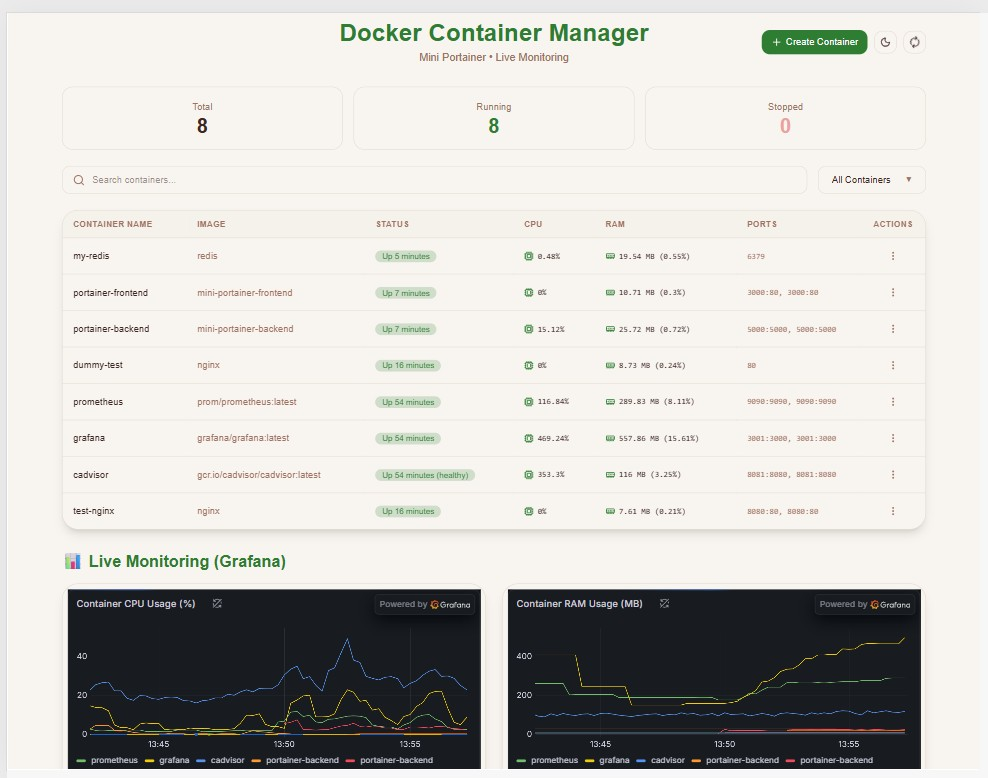
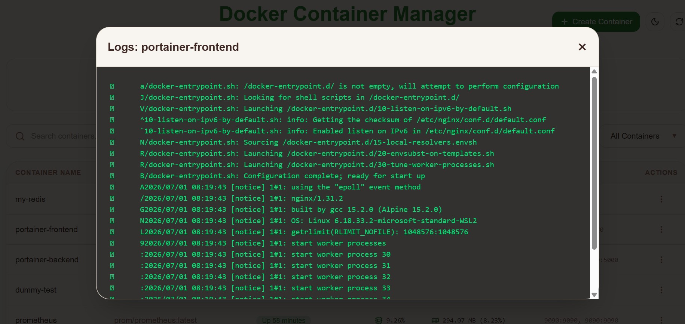
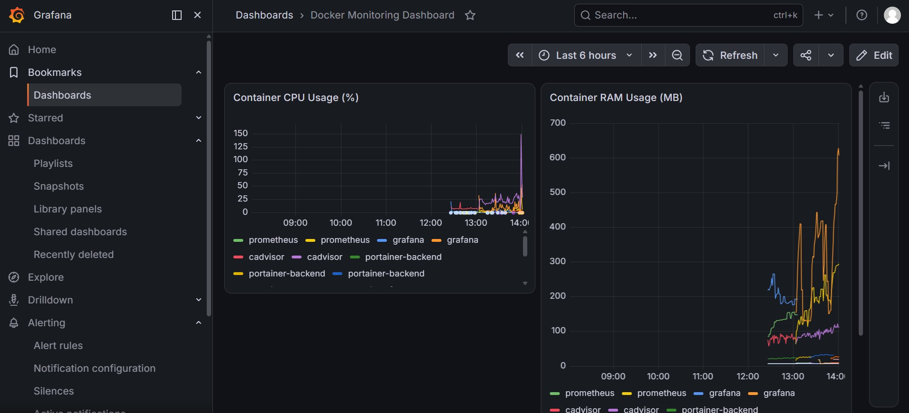

# 🐳 Docker Container Manager

A mini Portainer-style dashboard for managing Docker containers with real-time monitoring, built with React, Node.js, and the Docker Engine API.


## 📋 Overview

This project is a lightweight container management dashboard that allows users to view, control, and monitor Docker containers directly from a web interface — similar to Portainer, but built from scratch to understand how the Docker Engine API works under the hood.

## ✨ Features

- 📦 **List all containers** — view running and stopped containers
- ▶️ **Start / Stop / Restart** containers with one click
- 📄 **View live logs** for any container
- 📊 **CPU & RAM usage** monitoring per container
- 🔍 **Search** containers by name
- 🔄 **Auto-refresh** every 5 seconds
- 🐳 **Fully containerized** using Docker Compose
- 📈 **Advanced monitoring** with Prometheus + Grafana + cAdvisor

## 🛠️ Tech Stack

| Layer | Technology |
|-------|-----------|
| Frontend | React (Vite), Tailwind CSS |
| Backend | Node.js, Express |
| Container API | Dockerode (Docker Engine API) |
| Orchestration | Docker Compose |
| Monitoring | Prometheus, Grafana, cAdvisor |

## 🏗️ Architecture
┌─────────────┐ ┌──────────────┐ ┌─────────────────┐
│ React │─────▶│ Node.js │─────▶│ Docker Engine │
│ Frontend │◀─────│ Backend │◀─────│ API │
└─────────────┘ └──────────────┘ └─────────────────┘
│
┌───────────────────────┼────────────────┐
▼ ▼ ▼
┌─────────┐ ┌─────────────┐ ┌───────────┐
│cAdvisor │─────────▶│ Prometheus │──▶│ Grafana │
└─────────┘ └─────────────┘ └───────────┘

## 🚀 Getting Started

### Prerequisites
- Docker Desktop installed
- Node.js (for local development)

### Run with Docker Compose (Recommended)

```bash
git clone https://github.com/YOUR_USERNAME/docker-container-manager.git
cd docker-container-manager
docker compose up --build
Then open:

App: http://localhost:3000
Grafana: http://localhost:3001 (admin/admin)
Prometheus: http://localhost:9090
cAdvisor: http://localhost:8081
Run Locally (Development Mode)
Backend:

Bash

cd backend
npm install
npm run dev
Frontend:

Bash

cd frontend
npm install
npm run dev
📂 Project Structure
text

mini-portainer/
├── backend/
│   ├── server.js
│   ├── package.json
│   └── Dockerfile
├── frontend/
│   ├── src/
│   │   ├── App.jsx
│   │   └── index.css
│   ├── package.json
│   └── Dockerfile
├── docker-compose.yml
├── prometheus.yml
└── README.md
🔌 API Endpoints
Method	Endpoint	Description
GET	/containers	List all containers
POST	/containers/:id/start	Start a container
POST	/containers/:id/stop	Stop a container
POST	/containers/:id/restart	Restart a container
GET	/containers/:id/logs	Get container logs


## 📸 Screenshots

### Main Dashboard


### Create Container


### Container Logs


### Grafana Monitoring


## ✨ Features

- 🔐 **JWT Authentication** — secure login/logout with token-based auth
- 📦 **List all containers** — view running and stopped containers
- ▶️ **Start / Stop / Restart** containers with one click
- ➕ **Create containers** — pull images and run new containers from the UI
- 🗑️ **Delete containers** — remove containers with confirmation
- 📄 **View live logs** for any container
- 📊 **CPU & RAM usage** monitoring per container
- 🔍 **Search & Filter** — search by name, filter by status (All/Running/Stopped)
- 📈 **Stats summary** — Total / Running / Stopped counts
- 🔔 **Toast notifications** — clean, non-intrusive feedback
- 🔄 **Auto-refresh** every 5 seconds
- 🐳 **Fully containerized** using Docker Compose
- 📉 **Advanced monitoring** with Prometheus + Grafana + cAdvisor (embedded live graphs)

## 🔑 Default Login