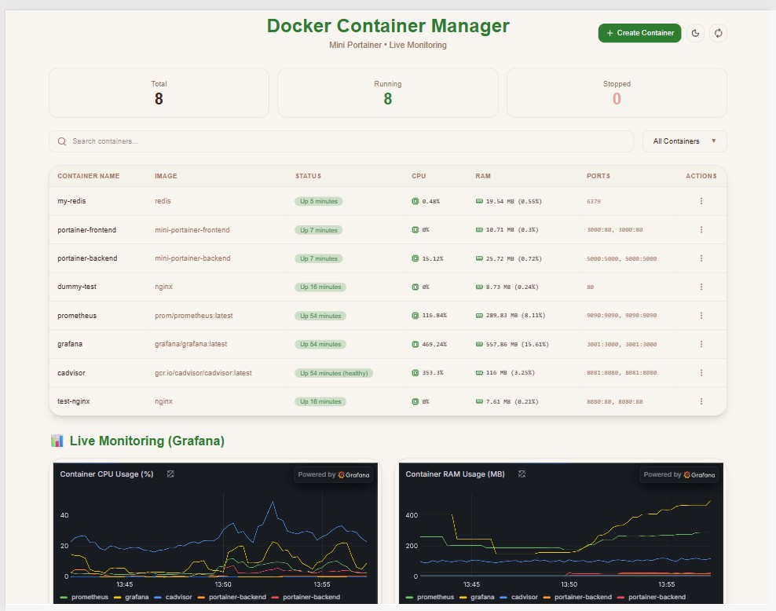
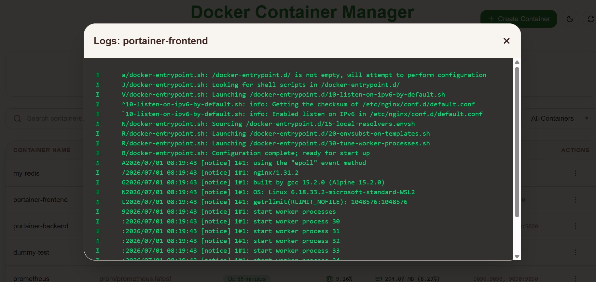
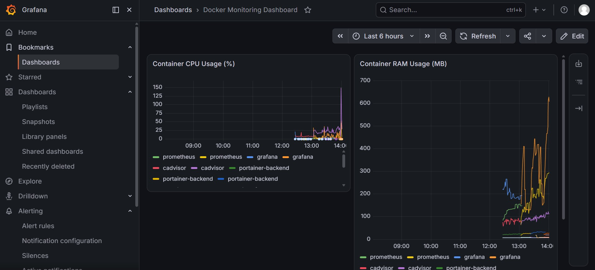

# 🐳 Docker Container Manager

A mini Portainer-style dashboard for managing Docker containers with real-time monitoring, built with React, Node.js, Docker Engine API, Prometheus, and Grafana.

[](https://www.loom.com/share/e7bc81449f594940b6b69a9bdb63c4b9)

> Click the badge above to watch the full project walkthrough video.


---

## 📋 Overview

This project is a lightweight container management dashboard that allows users to view, control, and monitor Docker containers directly from a web interface — similar to Portainer, but built from scratch to understand how the Docker Engine API works under the hood.

---

## ✨ Features

- 🔐 **JWT Authentication** — secure login/logout with token-based auth
- 🔑 **Portfolio Demo Auto-fill** — 1-click credential auto-fill for portfolio visitors and recruiters
- 📦 **List all containers** — view running and stopped containers
- ▶️ **Start / Stop / Restart** containers with one click
- ➕ **Create containers** — pull images and run new containers from the UI
- 🗑️ **Delete containers** — remove containers with confirmation modal
- 📄 **View live logs** for any container
- 📊 **CPU & RAM usage** monitoring per container
- 🔍 **Search & Filter** — search by name, filter by status (All / Running / Stopped)
- 📈 **Stats summary** — Total / Running / Stopped container counts
- 🔄 **Auto-refresh** every 5 seconds
- 🛡️ **Core System Protection** — safeguards against stopping or deleting essential infrastructure
- 🌐 **Single-Port Nginx Reverse Proxy** — routes frontend, API, and Grafana under one port (80)
- 📉 **Advanced monitoring** with Prometheus + Grafana + cAdvisor (embedded live graphs)
- 🧹 **Auto-cleanup script** — cron job to automatically reset demo containers on your server

---

## 🛠️ Tech Stack

| Layer | Technology |
|-------|-----------|
| **Frontend** | React (Vite), Tailwind CSS, Lucide Icons |
| **Backend** | Node.js, Express, Dockerode (Docker Engine API) |
| **Reverse Proxy** | Nginx (Alpine) |
| **Orchestration** | Docker Compose |
| **Monitoring & Metrics** | Prometheus, Grafana, cAdvisor |

---

## 🏗️ Architecture

```
Browser / Recruiter
        │  (HTTP / Port 80)
        ▼
┌───────────────────────────────────────────────────────────┐
│              Frontend Container (Nginx Alpine)            │
│  ┌──────────────────────┬───────────────┬──────────────┐  │
│  │   React SPA (/)      │  /api/ proxy  │ /grafana/ prx│  │
│  └──────────────────────┴───────┬───────┴──────┬───────┘  │
└─────────────────────────────────┼──────────────┼──────────┘
                                  ▼              ▼
                     ┌──────────────────┐  ┌───────────┐
                     │ Node.js Backend  │  │  Grafana  │
                     └─────────┬────────┘  └─────▲─────┘
                               │                 │
                      /var/run/docker.sock       │
                               │           ┌─────┴───────┐
                               ▼           │ Prometheus  │
                     ┌──────────────────┐  └─────▲───────┘
                     │  Docker Engine   │        │
                     └──────────────────┘  ┌─────┴───────┐
                                           │  cAdvisor   │
                                           └─────────────┘
```

---

## 📸 Screenshots

### Main Dashboard


### Create Container


### Container Logs


### Grafana Monitoring


---

## 🔑 Default Credentials

| Service | URL | Credentials |
| :--- | :--- | :--- |
| **Docker Manager** | `http://<SERVER_IP>:80` (or `http://localhost:3000`) | `admin` / `admin123` |
| **Grafana** | `http://<SERVER_IP>:80/grafana` (or port `3001`) | `admin` / `admin` (or auto-embedded) |
| **Prometheus** | `http://<SERVER_IP>:9090` | Public / Open |
| **cAdvisor** | `http://<SERVER_IP>:8081` | Public / Open |

> 💡 *The web dashboard includes a 1-click **"Auto-fill"** button on the login screen for portfolio visitors.*

---

## 🌐 Cloud Production Deployment (AWS EC2 / Linux VPS)

To showcase this project live on your portfolio, deploy it on a cloud virtual machine with root access to Docker.

### 1. Launch a Cloud VM
- **AWS EC2** (`t2.micro` / `t3.micro` Free Tier) or **DigitalOcean Droplet** / **Oracle Cloud Always Free**.
- **OS**: Ubuntu 22.04 LTS or 24.04 LTS.
- **Firewall / Security Group Rules**:
  - `22` (SSH) — Restricted to your IP
  - `80` (HTTP) — `0.0.0.0/0` (Dashboard, API, and Grafana via reverse proxy)
  - `443` (HTTPS) — `0.0.0.0/0` (Optional for SSL)

### 2. Install Docker & Docker Compose
SSH into your server:
```bash
ssh -i your-key.pem ubuntu@<SERVER_IP>
```
Install Docker:
```bash
sudo apt update && sudo apt upgrade -y
curl -fsSL https://get.docker.com -o get-docker.sh
sudo sh get-docker.sh
sudo usermod -aG docker $USER
newgrp docker
```

### 3. Clone Repository & Configure Environment
```bash
git clone https://github.com/prashmapoojary/docker-container-manager.git
cd docker-container-manager

# Copy environment file
cp .env.example .env
```
*(You can customize `ADMIN_USER`, `ADMIN_PASS`, or `JWT_SECRET` in `.env`)*

### 4. Launch Stack with One Command
```bash
docker compose up -d --build
```

### 5. Launch Standard Demo Containers
Run sample containers so visitors can see live metrics and interact immediately:
```bash
docker run -d --name demo-nginx -p 8082:80 nginx:alpine
docker run -d --name demo-redis redis:alpine
```

Now open `http://<YOUR_SERVER_IP>` in your browser!

---

## 🛡️ Portfolio Security & Auto-Reset Cron

Because the dashboard gives control over Docker containers, two enterprise-grade safeguards are built-in:

1. **System Container Protection**: The backend blocks `stop`, `restart`, and `delete` requests targeting the core management containers (`portainer-backend`, `portainer-frontend`, `cadvisor`, `prometheus`, `grafana`).
2. **Automated Demo Reset Cron**: To prevent visitors or bots from leaving excess or broken containers on your server, a cleanup script is provided in `scripts/reset-demo.sh`:
```bash
# Make script executable
chmod +x scripts/reset-demo.sh

# Schedule cron job (cleans up visitor containers every 3 hours)
(crontab -l 2>/dev/null; echo "0 */3 * * * $(pwd)/scripts/reset-demo.sh >> /var/log/demo-reset.log 2>&1") | crontab -
```

---

## 💻 Local Development Workflow

### Option 1: Docker Compose (Recommended)
```bash
docker compose up --build
```
Open `http://localhost` (or set `PORT=3000` in `.env` for `http://localhost:3000`).

### Option 2: Standalone Local Mode (Without Docker)
```bash
# Terminal 1: Backend
cd backend
npm install
npm run dev

# Terminal 2: Frontend
cd frontend
npm install
npm run dev
```

---

## 🔌 API Endpoints

| Method | Endpoint | Description | Auth Required |
| :--- | :--- | :--- | :---: |
| `POST` | `/login` | Authenticate and obtain JWT token | ❌ |
| `GET` | `/containers` | List all containers (running & stopped) | ✅ |
| `POST` | `/containers/:id/start` | Start container by ID | ✅ |
| `POST` | `/containers/:id/stop` | Stop container (protected for system services) | ✅ |
| `POST` | `/containers/:id/restart` | Restart container | ✅ |
| `DELETE`| `/containers/:id` | Remove container | ✅ |
| `GET` | `/containers/:id/logs` | Fetch container logs (tail 100) | ✅ |
| `GET` | `/containers/:id/stats` | Real-time CPU & RAM calculation | ✅ |
| `POST` | `/containers/create` | Pull image & create new container | ✅ |

---

## 🔄 Common Commands Cheat Sheet

| Task | Command |
| :--- | :--- |
| **Start in background** | `docker compose up -d` |
| **Rebuild after edits** | `docker compose up -d --build` |
| **Stop all services** | `docker compose down` |
| **View live logs** | `docker compose logs -f frontend backend` |
| **Inspect running containers** | `docker ps` |
| **Run demo reset script** | `./scripts/reset-demo.sh` |

---

## 🆘 Troubleshooting

- **"Cannot connect to Docker daemon"**: Ensure Docker Desktop is running on Windows, or `sudo systemctl status docker` is active on Linux.
- **"Port already in use"**: Change `PORT=8080` in `.env`, or stop conflicting services with `docker compose down`.
- **"Protected container: Cannot stop core system services"**: Core infrastructure containers are protected by backend policy to prevent downtime during live demos.
